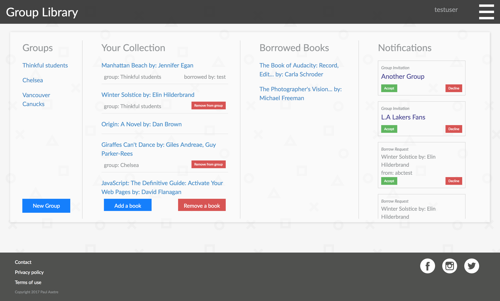
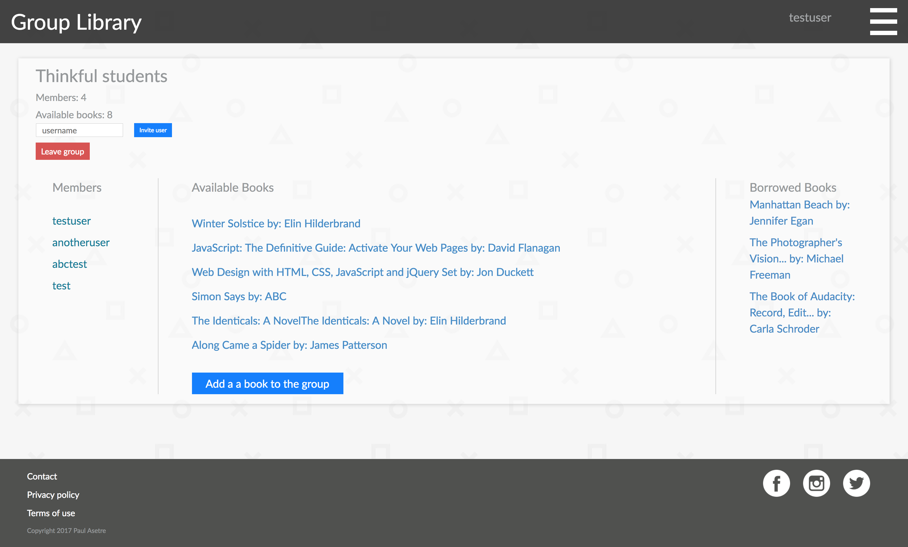

Group Library
===

Main Functionality
---

[Link to live app](http://ec2-18-217-17-51.us-east-2.compute.amazonaws.com/)

Users create and join groups where they can share books with each other. The application tracks which group the books is in, who is borrowing the book, and if the book has been returned. To borrow a book send a borrow request for the book, to return the book send a return request for the owner to accept/decline.

Dashboard
---
The dashboard is where most of the use would spend their time, here users can:
* accept/decline group invitations
* accept/decline book borrow requests
* accept/decline book return requests
* Go to groups
* view books
* add/remove books to their collection
* view books they are currently borrowing



Group
---
Inside the group is where users can:
* send group invitations
* request to borrow books
* view the books and users inside the group
* add a book to the group from the users collection



Test Accounts
---
For testing purposes you can use this account:
```
username: testuser
password: testtest
```
